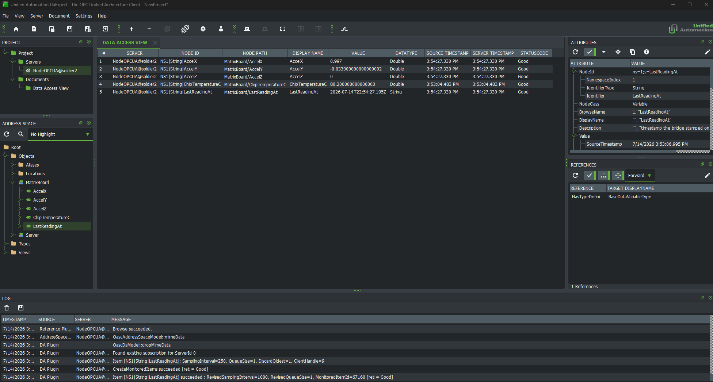

# plantfloor

A small but real industrial-IoT pipeline running on one PC and one ESP32-S3 LED matrix
board, built as a hands-on lab for the two protocols factories actually use: MQTT and
OPC UA.

## Data flow

```
ESP32-S3 matrix board (HTTP API on the LAN)
        |
        |  polled every 3 s
        v
bridge/bridge.ts ---publishes---> Mosquitto broker (Docker, port 1883)
                                     |                     |
                          subscribes |          subscribes |
                                     v                     v
                      historian/ (C# + SQLite)    opcua/server.ts (port 4840)
                      every message -> a row      latest values as OPC UA nodes
                      (plantfloor.db)             for any OPC UA client
```

Two consumers, two jobs: the historian keeps history, the OPC UA server answers
"what is the value right now" to standard industrial clients like UaExpert. Neither
knows the other exists; the broker decouples everything.

## Running the stack

1. Broker: `docker compose up -d` (Docker Desktop must be running)
2. Bridge: `node bridge/bridge.ts` (Node 22.6+ runs TypeScript directly, no build step)
3. Historian: `dotnet run --project historian`
4. OPC UA server: `node opcua/server.ts`

## Verifying (trust the destination, not the logs)

- `node scripts/dbcheck.js`: row count, duplicate check, and last publish times read
  straight out of `historian/plantfloor.db`.
- `node scripts/opcuacheck.ts`: connects to the OPC UA server the way a real client
  would and reads live values back.

## OPC UA in UaExpert

The server at `opc.tcp://localhost:4840` exposes the board under
`Objects > MatrixBoard`: `ChipTemperatureC`, `AccelX`, `AccelY`, `AccelZ`,
`LastReadingAt`, and `Online` (board liveness from the MQTT birth/last-will on
`plantfloor/status/matrix`). The screenshot below is the 2026-07-14 browse of the
first five nodes; `Online` was added to the server afterward and appears on the next
rebrowse. It reads `false` until the firmware publisher is flashed and holding the
connection (publishing its retained birth and leaving its will), so in the bridge phase
it shows `false` next to live data, which is honest, not a fault. Browsed live with
UaExpert, values updating as the physical board is moved:



Honest labeling note: `ChipTemperatureC` is the temperature of the ESP32's own
silicon, not the room. The board has no ambient temperature sensor.
